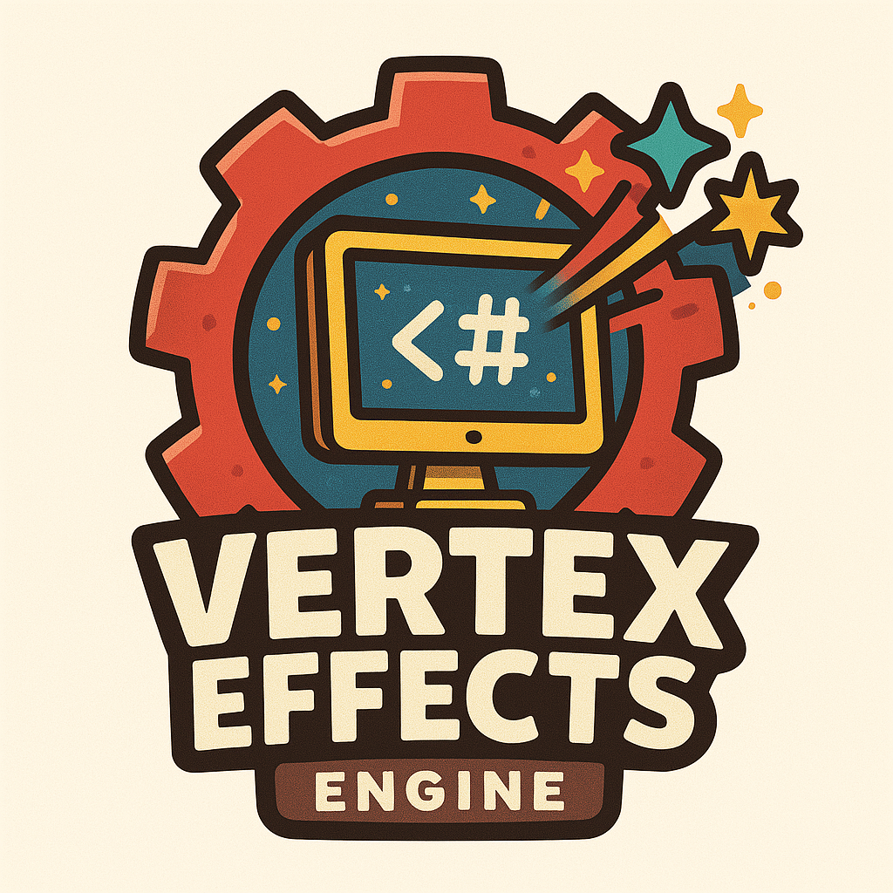

# Vertex Effects Engine Documentation
<div align="center">

<!-- Projeto principal -->
[](https://github.com/isamytanaka/Vertex_Effects_Engine_Csharp)

<!-- Linguagens e tecnologias -->


<!-- Arquitetura e design -->


<!-- Status e desenvolvimento -->
[](https://github.com/isamytanaka/Vertex_Effects_Engine_Csharp/releases)


[](https://github.com/isamytanaka/Vertex_Effects_Engine_Csharp/blob/main/LICENSE)

<!-- Plataforma e documentação -->


<!-- Desenvolvedor e GitHub -->

[](https://github.com/isamytanaka/Vertex_Effects_Engine_Csharp)

</div>


## Introduction

> The **Vertex Effects Engine** is a **tool** that helps you create visual effects for games. It works by taking a special language and turning it into C# code that Unity can use.

**Important Note**: This is version 1.0 of the engine. The generated code may contain errors or bugs. Please check the output code before using it in your projects.

## What Can It Do?

This engine lets you:
- Create custom visual effects
- Add animations to game objects
- Handle events in your effects
- Set parameters for your effects

## How to Use

### Basic Structure

When writing effects, you need to follow this structure:

```
effect YourEffectName
  requires LibraryName
  param Type Name = Value
  animate Property from Value to Value over Duration
  on EventName do
    // actions
  end
  render ObjectName with Properties
end effect
```

### Example

Here's a simple example of a glow effect:

```
effect Glow
  param float intensity = 1.0
  param float speed = 0.5
  animate intensity from 0.5 to 2.0 over 1.0
  render _EmissionColor with intensity
end effect
```

## Complete Usage Guide

### Step 1: Install the Engine

1. Make sure you have Lua installed on your system
2. Copy the `vertex_engine.lua` file to your project folder
3. Check compatibility with your system:

```lua
local VertexEngine = require("vertex_engine")
local compatible, issues = VertexEngine.checkCompatibility()
if not compatible then
    for _, issue in ipairs(issues) do
        print(issue)
    end
end
```

### Step 2: Create Your Effect File

Create a new file with the `.vfx` extension. For example, `glow.vfx`:

```
effect Glow
  param float intensity = 1.0
  param float speed = 0.5
  animate intensity from 0.5 to 2.0 over 1.0
  render _EmissionColor with intensity
end effect
```

### Step 3: Compile Your Effect

Use the engine to compile your effect:

```lua
local VertexEngine = require("vertex_engine")
local success, message = VertexEngine.execute("glow.vfx")
print(message)
```

### Step 4: Add to Unity

1. Copy the generated `.cs` file to your Unity project's Assets folder
2. Make sure the file is in a proper namespace
3. Unity will automatically compile the script

### Step 5: Use the Effect in Your Game

```csharp
// C# code in Unity
using UnityEngine;
using VertexEffects;

public class EffectController : MonoBehaviour
{
    void Start()
    {
        // Initialize the engine
        VertexEffectsEngine.Instance.Initialize();
        
        // Get your effect
        var glowEffect = VertexEffectsEngine.Instance.GetEffect("Glow");
        
        // Apply to this game object
        glowEffect.Apply(gameObject);
    }
    
    void Update()
    {
        // Update all active effects
        // You'll need to implement this part
    }
}
```

## Effects Language Reference

### Parameters

```
param float intensity = 1.0
param int count = 5
param string name = "effect1"
param color mainColor = #FF0000
```

### Animations

```
animate property from startValue to endValue over duration
```

Example:
```
animate opacity from 0.0 to 1.0 over 2.5
```

### Events

```
on eventName do
  // actions here
end
```

Example:
```
on start do
  // Initialize effect
end
```

### Rendering

```
render objectProperty with value
```

Example:
```
render _EmissionColor with intensity
```

### Libraries

```
requires LibraryName
```

Example:
```
requires ParticleSystem
```

## Troubleshooting Common Issues

### Compilation Errors

If you see compilation errors:
1. Check your syntax in the .vfx file
2. Make sure all parameters have correct types
3. Ensure all blocks are properly closed with `end`

### Unity Integration Issues

If the effect doesn't work in Unity:
1. Check Unity console for errors
2. Make sure the namespace matches
3. Verify that all required components are on your game object

### Performance Issues

If your effect runs slowly:
1. Reduce the number of animations
2. Simplify render operations
3. Check for memory leaks

## Known Limitations (Version 1.0)

1. **Code Generation Bugs**: The generated C# code might contain syntax errors or logical issues
2. **Limited Event Support**: Only basic events are supported
3. **Performance Optimizations**: Generated code may not be fully optimized
4. **Shader Integration**: Limited support for custom shaders
5. **Error Handling**: Error messages might not be descriptive enough

## Main Components

### Parser

The Parser reads your effect code and breaks it down into parts that the system can understand:
- It separates words, strings, and operators
- It builds a structure that represents your effect

### Generator

The Generator takes the structure created by the Parser and turns it into C# code:
- Creates proper Unity C# classes
- Adds all your parameters, animations, and events
- Makes code that Unity can run

### File System

The File System handles reading and writing files:
- Opens your effect files
- Saves the generated C# code
- Checks if your computer can run the engine

## Advanced Usage

### Creating Custom Token Types

You can extend the parser to support custom tokens:

```lua
-- Add to Parser.tokenize function
elseif char:match("@") then
    if current ~= "" then
        table.insert(tokens, {type = "word", value = current})
        current = ""
    end
    table.insert(tokens, {type = "special", value = char})
```

### Custom Code Generation

You can add custom code generation for new effect types:

```lua
-- Add to Generator.generateEffect function
if effect.type == "custom" then
    -- Generate special code here
end
```

## System Requirements

The engine checks if your computer can run it by:
- Checking how much memory you have (needs at least 50MB)
- Detecting if you're using Windows or Unix
- Making sure you have enough resources

## Next Steps

After compiling your effects, you can:
1. Add the generated C# files to your Unity project
2. Use the effects by calling the VertexEffectsEngine API
3. Apply effects to game objects using the `Apply()` method
4. Report any bugs you find since this is version 1.0
